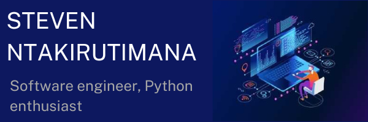
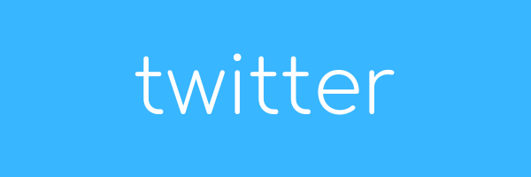
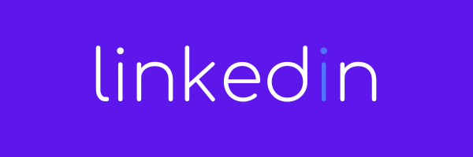

<!--
**sntakirutimana72/sntakirutimana72** is a ✨ _special_ ✨ repository because its `README.md` (this file) appears on your GitHub profile.

Here are some ideas to get you started:

- 🔭 I’m currently working on ...
- 🌱 I’m currently learning ...
- 👯 I’m looking to collaborate on ...
- 🤔 I’m looking for help with ...
- 💬 Ask me about ...
- 📫 How to reach me: ...
- 😄 Pronouns: ...
- ⚡ Fun fact: ...
-->

## Hi there! I'm Steven 🤗

  

I believe in the power of collaboration and the time invested into achieving something. 
I spend most of my time honing my software development skills and exploring different ways 
I can improve both my technical and soft skills.

I've learned to code using different languages and frameworks like, Python, Django, Kivy, Android, 
Angular, JavaScript. I'm currently enrolled in Microverse Program where I'm learning about web development 
using powerful tools like GitHub, JavaScript, Ruby on rails, React all by creating project and 
collaborating with fellow Micronauts.

  
  
  

